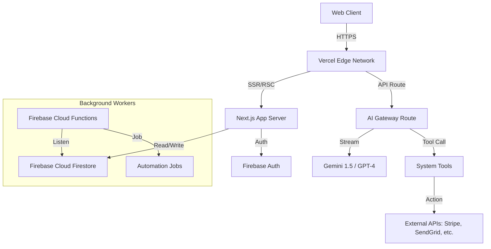

# AIVaultsAI.one - Technical Blueprint & Master Plan
## Version 1.0 | Status: APPROVED

## 1. High-Level Architecture Overview

The platform uses a **hybrid serverless architecture**:
- **Frontend/Edge**: Vercel (Next.js 14 App Router) handles UI rendering and low-latency API routes.
- **Backend Services**: Firebase (Google Cloud) handles Authentication, Database (Firestore), File Storage, and heavy background jobs (Cloud Functions).
- **AI Core**: Centralized AI Gateway utilizing Gemini 1.5 Pro / GPT-4o via Vercel AI SDK for streaming and tool execution.

### Architecture Diagram


---

## 2. Detailed Tech Stack

### Frontend
- **Framework**: Next.js 14+ (App Router, Server Actions)
- **Language**: TypeScript
- **Styling**: TailwindCSS 3.4+, standard CSS variables for theming.
- **UI Component Library**: Custom (Radix Primitives + Lucide Icons).
- **Animations**: Framer Motion.
- **State Management**: React Context + Zustand (for complex global state like AI sessions).

### Backend & Data
- **Database**: Firebase Cloud Firestore (NoSQL).
- **Authentication**: Firebase Auth (Google + Email/Password).
- **Storage**: Firebase Storage (User assets, AI generated files).
- **Serverless**: Next.js API Routes (Edge/Node.js) + Firebase Functions (Node.js 20).

### AI Engine
- **Orchestration**: Vercel AI SDK (legacy support or custom implementation if needed for advanced agentic loops).
- **Models**: Gemini 1.5 Pro (Primary - Cost/Perf), GPT-4o (Fallback/Specialized).
- **Memory**: Vector embedding search (Pinecone or simple cosine sim in PG if needed, but starting with Firestore conversation history windowing).

---

## 3. Database Schema (Firestore)

### `users/{userId}`
- `email`: string
- `displayName`: string
- `role`: "user" | "admin" | "subscriber"
- `subscriptionTier`: "free" | "pro" | "enterprise"
- `createdAt`: timestamp

### `conversations/{conversationId}`
- `userId`: string (ref)
- `type`: "support" | "employee" | "sales"
- `status`: "active" | "archived"
- `messages`: Sub-collection or Array of message objects (role, content, timestamp)
- `metadata`: map (context data)

### `ai_employees/{employeeId}`
- `name`: string
- `role`: string (e.g. "Sales Rep")
- `systemPrompt`: string
- `tools`: array[string] (Allowed tool IDs)
- `accessLevel`: string
- `ownerId`: string (ref)

### `automation_jobs/{jobId}`
- `type`: "lead_gen" | "content_creation"
- `status`: "pending" | "processing" | "completed" | "failed"
- `inputData`: map
- `outputData`: map
- `logs`: array
- `createdAt`: timestamp

### `leads/{leadId}`
- `email`: string
- `source`: string
- `score`: number
- `status`: "new" | "contacted" | "converted"
- `capturedBy`: string (AI Employee ID)

---

## 4. File Structure (Next.js App Router)

```text
/
├── .agent/                  # Agent workflows and docs
├── public/                  # Static assets
├── src/
│   ├── app/                 # Next.js App Router
│   │   ├── (auth)/          # Authentication Routes Group
│   │   │   ├── login/
│   │   │   └── register/
│   │   ├── (marketing)/     # Public Marketing Pages
│   │   │   ├── page.tsx     # Landing Page
│   │   │   └── pricing/
│   │   ├── (dashboard)/     # Protected App Routes
│   │   │   ├── dashboard/
│   │   │   ├── employees/
│   │   │   │   ├── [id]/
│   │   │   │   └── page.tsx
│   │   │   └── settings/
│   │   ├── api/             # Backend API Routes
│   │   │   ├── ai/
│   │   │   │   ├── chat/    # Main chat endpoint
│   │   │   │   └── worker/  # Task execution endpoint
│   │   │   └── webhooks/    # Stripe/External hooks
│   │   ├── layout.tsx       # Root Layout
│   │   └── globals.css      # Global Styles
│   ├── components/
│   │   ├── ui/              # Reusable base components (Button, Input)
│   │   ├── layout/          # Header, Sidebar, Footer
│   │   ├── features/        # Feature-specific components
│   │   │   ├── chat/
│   │   │   └── dashboard/
│   │   └── shared/
│   ├── lib/                 # Utilities and Logic
│   │   ├── firebase/        # Client & Admin SDK init
│   │   ├── ai/              # AI service logic & tools
│   │   ├── hooks/           # Custom React hooks
│   │   ├── store/           # State management
│   │   ├── utils.ts         # CN and other helpers
│   │   └── types.ts         # TypeScript definitions
│   └── styles/              # Design tokens (if separate)
├── firebase.json            # Firebase Hosting/Functions Config
├── next.config.mjs
├── tailwind.config.ts
└── tsconfig.json
```

---

## 5. Build Roadmap (Phase 1-7 Implementation Plan)

### Phase 1: Foundation & Frontend Skeleton
- **Objective**: Operational website with professional design system.
1. Initialize Next.js 14 project with TypeScript.
2. Configure TailwindCSS with custom design system (colors, typography).
3. Implement core UI components (Button, Card, Input) with high-end aesthetics.
4. Build Landing Page (Hero, Features, Pricing) to look premium.
5. Set up Firebase Project & connect environment variables.

### Phase 2: Core Backend & Auth
- **Objective**: Users can sign up and login.
1. Implement Firebase Auth (Context provider + Middleware protections).
2. Create `(auth)` pages with validation.
3. Set up Firestore security rules.
4. Create user profile creation on signup webhooks/triggers.

### Phase 3: AI Engine Implementation
- **Objective**: Conversational AI works.
1. Build `src/lib/ai` service layer.
2. Implement `/api/ai/chat` with streaming response support.
3. Create the `ChatInterface` component (UI for chat).
4. Integrate basic system prompts for "AI Employees".

### Phase 4: Data Layer & Dashboard
- **Objective**: User data management.
1. Build Dashboard Shell (Sidebar, Header).
2. Implement Firestore CRUD for `ai_employees`.
3. Create "Hire Employee" flow (configure and save new AI agent).
4. Connect Chat Interface to specific Employee IDs.

### Phase 5: Advanced Tooling & Automation
- **Objective**: AI can "do" things.
1. Define Tool interfaces (WebSearch, CRMUpdate, LeadScore).
2. Implement tool execution logic in the AI Backend.
3. Build the `automation_jobs` infrastructure (async processing).

### Phase 6: Commercial Features
- **Objective**: Monetization.
1. Integrate Stripe Checkout.
2. Implement Paywalls/Subscription checks in middleware.
3. Build Admin panel for global metrics.

### Phase 7: Launch & Optimization
1. Full SEO pass (Metadata, Sitemap).
2. Performance optimization (Image optimization, Code splitting).
3. Final security audit (Rules, API keys).
4. Deploy to Production.

---

## 6. Development Guidelines for Agents

- **Atomic Commits**: Complete one task at a time, verify, then move to the next.
- **Verification**: Always verify a build works (`npm run build`) before declaring a step done.
- **Type Safety**: No `any`. Use proper interfaces in `types.ts`.
- **Secrets**: NEVER commit API keys. Use `.env.local`.
- **Mobile First**: All UI must be fully responsive.
